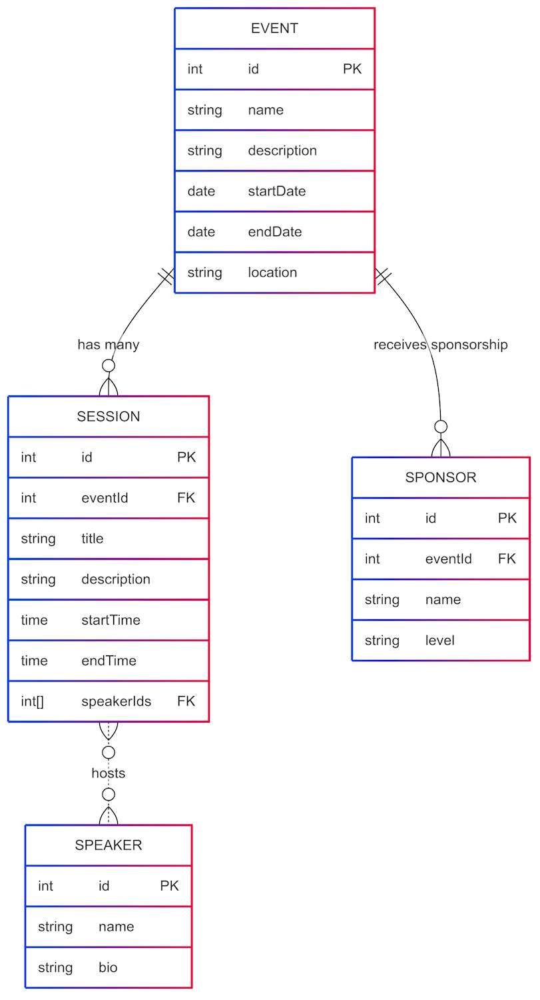
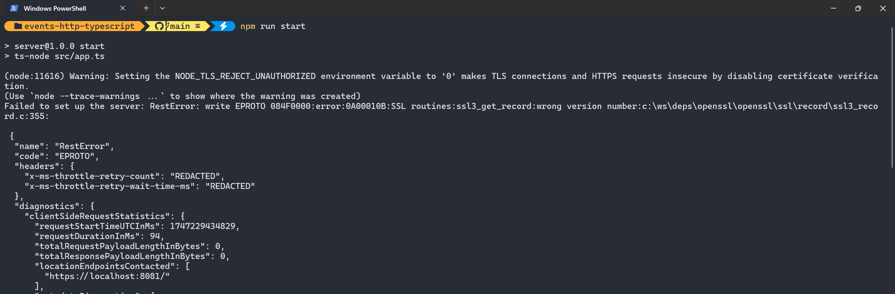
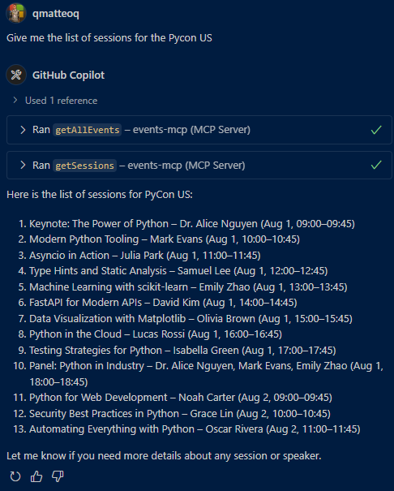
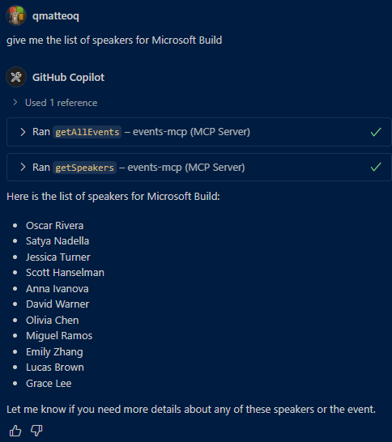

# 🏬 Events Management Server Sample

Welcome to the **Events Management Server Sample**. In this sample, you will learn how to run the MCP Server locally, and then add it to GitHub Copilot and Microsoft Copilot Studio.
This sample provides the infrastructure for an event management system. It uses Cosmos DB to store the information about events, speakers, sessions and sponsors. The following diagram shows the database structure:



The server provides the same capabilities exposed in two ways:

- As MCP server using the HTTP Streaming transport protocol, so that you can enable your AI applications and agents to interact with it
- As a REST API, so that you can use it in your applications

## The MCP server
The MCP server uses the HTTP Streaming transport protocol to expose the following capabilities:

- `getAllEvents` | Get the list of all the available events
- `getSessions` | Get the list of all the sessions, optionally for a specific event
- `getSpeakers` | Get the list of all the speakers, optionally for a specific event
- `getSponsors` | Get the list of all the sponsors, optionally for a specific event

## The REST API
The REST API exposes the same capabilities as the MCP server, but using a RESTful approach. The following endpoints are available:

- `GET /events` | Get the list of all the available events
- `GET /events/{eventId}/sessions` | Get the list of all the sessions for a specific event
- `GET /events/{eventId}/speakers` | Get the list of all the speakers for a specific event
- `GET /events/{eventId}/sponsors` | Get the list of all the sponsors for a specific event
- `GET /sessions` | Get the list of all the sessions
- `GET /speakers` | Get the list of all the speakers
- `GET /sponsors` | Get the list of all the sponsors

In the [http](./http/requests.http) folder you can find a HTTP file you can use to test the REST API. You can open it in Visual Studio Code and run the requests directly from there.
You will need the [REST Client](https://marketplace.visualstudio.com/items?itemName=humao.rest-client) extension to run the requests.

## ⚙️ Prerequisites

- Visual Studio Code ([link](https://code.visualstudio.com/download))
- Node v22 (ideally installed via [nvm for Windows](https://github.com/coreybutler/nvm-windows))
- GitHub account
- The Cosmos DB emulator installed:
  - If you're running an x86 or x64 version of your OS, you can either use the standalone emulator or the Docker image. You can find the instructions [here](https://learn.microsoft.com/azure/cosmos-db/how-to-develop-emulator?tabs=docker-linux%2Ccsharp&pivots=api-nosql)
  - If you're running an ARM version of your OS, you must use the preview, which is available only as a Docker image. You can find the instructions [here](https://learn.microsoft.com/azure/cosmos-db/emulator-linux)
 - Power Platform Environment provisioned with the following toggle on:

    

> [!IMPORTANT]  
> If you opt-in to use the preview of the new version of the Cosmos DB emulator, you must execute the following commands:

1) Pull the Docker image:

```bash
docker pull mcr.microsoft.com/cosmosdb/linux/azure-cosmos-emulator:vnext-preview
```
2) Run the Docker image by explicitly enabling the HTTPS protocol using the `--protocol` parameter. By default, in fact, the emulator exposes only HTTP, but the Cosmos DB SDK requires HTTPS:

```bash
docker run --detach --publish 8081:8081 --publish 1234:1234 mcr.microsoft.com/cosmosdb/linux/azure-cosmos-emulator:vnext-preview --protocol https
```

If you don't do this, you will get SSL errors like the one in the screenshot below when you run the server:



## 💿 Populating the database

The database can be populated using two CSV files, one for the events and one for the sessions. The sample contains two sample CSV files in the `data` folder.
To ingest the data into the database, you can follow these steps:

1. Create a `.env` file in the `samples/events-http-typescript` folder and add the following variables:

    ```text
    COSMOS_DB_CONNECTION_STRING="<your-cosmos-db-connection-string>"
    COSMOS_DB_DATABASE_ID="eventsdb"
    ```

    If you are using the emulator, you can use the following connection string:

    ```text
    COSMOS_DB_CONNECTION_STRING="AccountEndpoint=https://localhost:8081/;AccountKey=C2y6yDjf5/R+ob0N8A7Cgv30VRDJIWEHLM+4QDU5DE2nQ9nDuVTqobD4b8mGGyPMbIZnqyMsEcaGQy67XIw/Jw=="
    COSMOS_DB_DATABASE_ID="eventsdb"
    ```

1. Open the terminal on the `samples/events-http-typescript` folder.
1. Run the command `npm install` to install the dependencies.
1. Run the command `npm run start` to start the server for the first time. This will create the database and the container.
1. Quit the server by pressing `ctrl` + `c` in the terminal.
1. Run the following command to import the events:

    ```bash
    npm run start:importEvents -- <path-to-your-csv-file>
    ```

    For example, if you want to import the `events.csv` file included in the repository, you can run the following command:

    ```bash
    npm run start:importEvents -- ./data/events.csv
    ```
1. Now run the following command to import the sessions:

    ```bash
    npm run start:importSessions -- <path-to-your-csv-file>
    ```

    For example, if you want to import the `sessions.csv` file included in the repository, you can run the following command:

    ```bash
    npm run start:importSessions -- ./data/sessions.csv
    ```

If you want to create your own CSV files, you can use the following format.

### Events CSV file

The file should contain the following columns:

- Event Id: the unique identifier of the event, it must be a GUID
- Event name: the name of the event
- Description: the description of the event
- Start date: the start date of the event, in the format `yyyy-MM-dd`
- End date: the end date of the event, in the format `yyyy-MM-dd`
- Location: the location of the event
- Sponsors: the sponsors of the event, separated by commas

### Sessions CSV file
The file should contain the following columns:

- Event ID: the unique identifier of the event, it must be a GUID
- Session title: the title of the session
- Session description: the description of the session
- Session speakers: the speakers of the session, separated by commas
- Session start time: the start time of the session, in the format `yyyy-MM-ddTHH:mm:ss`
- Session end time: the end time of the session, in the format `yyyy-MM-ddTHH:mm:ss`

## 🚀 Minimal path to awesome

1. Open Visual Studio Code on the subfolder `samples/events-http-typescript`
1. Open the terminal and navigate to the same folder
1. Run `npm run start`

    

1. Select `PORTS` at the top of the Visual Studio Code Terminal

    

1. Select the green `Forward a Port` button

    

1. Enter `3000` as the port number (this should be the same as the port number you see when you ran the command in step 5). You might be prompted to sign in to GitHub, if so please do this, since this is required to use the port forwarding feature.
1. Right click on the row you just added and select `Port visibility` > `Public` to make the server publicly available
1. Ctrl + click on the `Forwarded address`, which should be something like: `https://something-3000.something.devtunnels.ms`
1. Select `Copy` on the following pop-up to copy the URL

     

1.  Open to the browser of your choice and paste the URL in the address bar, type `/mcp` behind it and hit enter

If all went well, you will see the following error message:

```json
{"jsonrpc":"2.0","error":{"code":-32000,"message":"Method not allowed."},"id":null}
```

Don't worry - this error message is nothing to be worried about!

If you want to test the REST API, you can open the `http/requests.http` file in Visual Studio Code and run the requests directly from there. You will need the [REST Client](https://marketplace.visualstudio.com/items?itemName=humao.rest-client) extension to run the requests.

## 👨‍💻 Use the Events Management MCP Server in Visual Studio Code / GitHub Copilot

To use the Events Vacations MCP Server, you need to use the URL of your server with the `/mcp` part at the end and add it as an MCP Server in Visual Studio Code.

1. Press either `ctrl` + `shift` + `P` (Windows/Linux) or `cmd` + `shift` + `P` (Mac) and type `MCP`
1. Select `MCP: Add Server...`
1. Select `HTTP (HTTP or Server-Sent Events)`
1. Paste the URL of your server in the input box (make sure `/mcp` in the end is included)
1. Press `Enter`
1. Enter a name for the server, for instance `EventsMCP`
1. Select `User Settings` to save the MCP Server settings in your user settings
1. Open `GitHub Copilot`
1. Switch from `Ask` to `Agent`
1. Make sure the `EventsMCP` server actions are enabled
1. Now you can try some of the following questions:

    ```text
    Give me the list of the events
    Give me the list of sessions for Microsoft Build
    Give me the list of speakers for Azure Global Bootcamp
    Give me the list of sponsors for Pycon US
    ```
This should give you responses like the following ones. You will notice the ability of the agent to automatically call multiple tools to achieve the desired result (for example, one call to get all the events, and then a second call to get the sessions for the event you asked for using the eventId).





Now you have added the `EventsMCP` server to Visual Studio Code!

## 👨‍💻 Use the Events Management MCP Server in Microsoft Copilot Studio

1. Go to https://make.preview.powerapps.com/customconnectors (make sure you’re in the correct environment) and click + New custom connector. 
1. Select `Import from GitHub`
1. Select `Custom` as **Connector Type**
1. Select `dev` as the **Branch**
1. Select `MCP-Streamable-HTTP` as the **Connector**
1. Select `Continue`

    

1. Change the **Connector Name** to something appropriate, like for instance `Events MCP` 
1. Change the **Description** to something appropriate
1. Paste your root URL (for instance `something-3000.something.devtunnels.ms`) in the **Host** field 
1. Select **Create connector** 

    You may see a warning and an error upon creation – it should be resolved soon - but you can ignore it for now.

1. Close the connector
1. Go to https://copilotstudio.preview.microsoft.com/  
1. Create your agent 
1. Select **Tools** > **Add a tool** > **Model Context Protocol** > And then select the MCP server you’ve just created